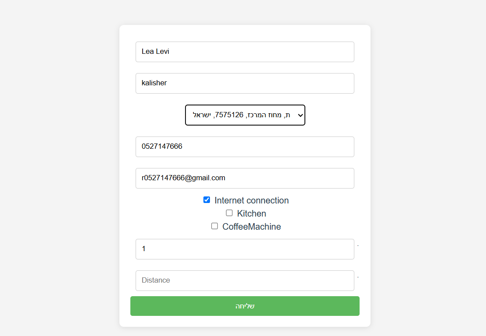
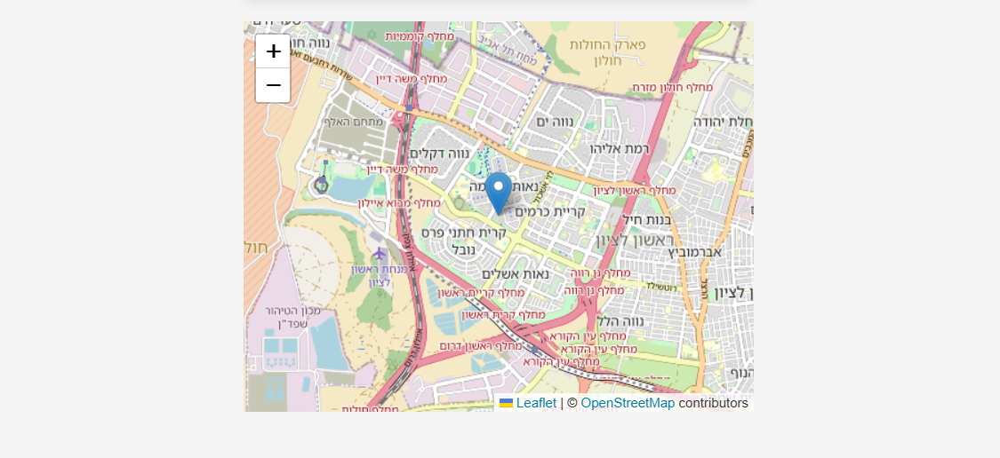

# ShareOffice Finder

A React-based website to help users find office-sharing partners by filling out a detailed form and displaying the selected location on a map.

##  Project Overview

This project allows users to input their shared office preferences, including address, features, and distance. It uses Nominatim API for autocomplete and geolocation, and displays the selected address on an interactive OpenStreetMap map.

## Screenshots



###  Project Goals

- Practice working with maps and geographic coordinates
- Implement address autocomplete and reverse geocoding
- Provide a clean and user-friendly interface for finding shared office spaces

---

## Technologies Used

- **React** – Frontend framework
- **React-Leaflet** – Map rendering using OpenStreetMap
- **Nominatim API** – Address autocomplete and geolocation
- **OpenStreetMap** – Map visualization
- **CSS / Styled Components** – Styling
- **TypeScript** *(optional)* – Type safety

---


##  How It Works

1. The user starts typing an address — a request is sent to **Nominatim API** for autocomplete suggestions.
2. When the user selects an address, we extract the coordinates (`lat`, `lon`) and `display_name`.
3. The selected location is then shown on the map using **OpenStreetMap** via **React-Leaflet**.


##  Getting Started
 1. Clone the repository
  ```sh
    git clone https://github.com/Riki2149/SearchInMap
  ```

 2. Navigate into the project directory
  ```sh
    cd SearchInMap
  ```

 3. Install dependencies
  ```sh
    npm install
  ```

 4. Run the project locally
  ```sh
    npm run dev
  ```